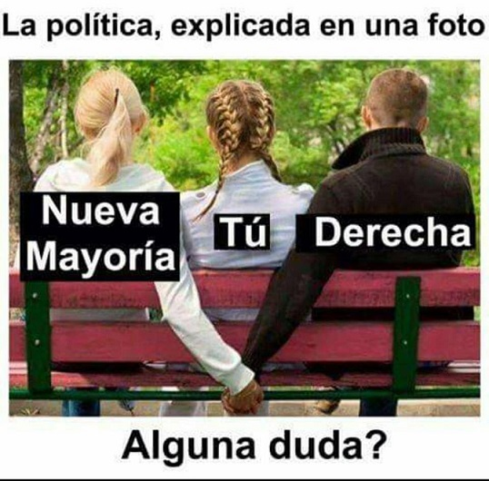

# Overview 

**SemanticMemes** is a large dataset of textually described memes in Spanish. To build this dataset, we are collecting all Chilean tweets with images posted from May 10th, 2019 until now. For the current version of the dataset, four experts manually classified a subset of 52,000 images. These experts were trained until they reached an inter-coder reliability (ICR) of 90% or above, and a Krippendorff's alpha of .7 or above. ICR was calculated on a subsample of 2,000 images not included in the final sample of 52,000 cases. Each expert classified 13,000 different images into four classes: *Meme*, *Non-meme*, *Sticker*, and *Doubtful*. Also, for images classified as *Memes* and *Stickers*, the experts transcribed the text in the image, provided a description of the contents in the image (subjects, places, colors, actions, etc.), and a semantic interpretation of the context and situation showed.

# Statistics
Total images: **52K**

- Meme: **1,194**

- Sticker: **1,443**

- No-meme: **49,347**

- Doubtful: **16**

Spanish Vocabulary: **8,669** words

# Example

{: .center}

### Annotation:
- **Text in Meme**: la política, explicada en una foto. nueva mayoría. tú, derecha. alguna duda?

- **Visual Description**: tres personas de espalda, sentadas en una banca. la persona de la izquierda y la derecha se están dando la mano por atrás de la banca.

- **Semantic Description**: alude que las coaliciones políticas en chile se encuentran confabuladas y se ponen de acuerdo respecto a como funciona el pais, dejando de lado a la ciudadanía.

# Citing the Dataset
```
@inproceedings{PerezMartin20ica,
               author = {Jesus Perez-Martin and Benjamin Bustos and Magdalena Saldana}
               title = {Semantic Search of Memes on Twitter},
               booktitle = {International Communication Association (ICA)},
               year = {2020},
               month = {May}
}
```

## Conctact 
[jeperez at dcc.uchile.cl](mailto:jeperez@dcc.uchile.cl)